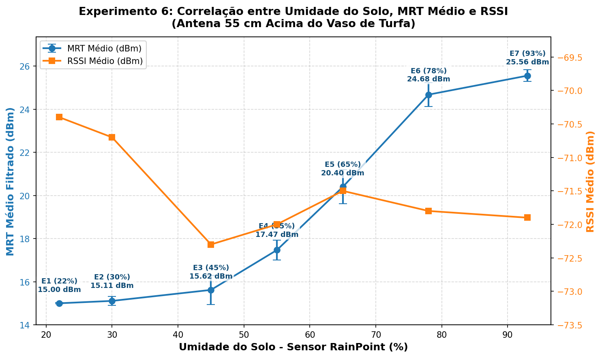

# Experimento 6 - Variação de Umidade do Solo em 7 Intervalos (Antena 55 cm Acima)

## 1. Visão Geral

O **Experimento 6** tem como objetivo mapear a correlação sistemática entre o teor de umidade do solo em um vaso de planta e as métricas de resposta RF da tag RFID UHF: **Limiar Mínimo de Resposta (MRT - bruto e filtrado por filtro passa-baixas EMA)** e **Intensidade do Sinal Recebido (RSSI)**.

Neste experimento:

- São investigados **7 diferentes intervalos de umidade**, iniciando em **22% de umidade do solo** (valor de calibração aferido pelo sensor comercial capacitivo **RainPoint** no solo inicial seco) e progredindo com adições graduais de água até **93%** (solo saturado).
- Para **cada intervalo**, foram executadas **1000 leituras/varreduras consecutivas** de MRT e RSSI.
- Ao término de cada rodada de 1000 leituras, calcula-se o **valor médio de MRT (bruto e filtrado)** e de **RSSI**, estabelecendo o mapeamento formal:
  $$\text{Umidade do Solo (\% RainPoint)} \longrightarrow \overline{\text{MRT}} \text{ (dBm)} \quad \text{e} \quad \overline{\text{RSSI}} \text{ (dBm)}$$
- A antena do leitor está fixada a **55 cm de altura diretamente acima da tag** (visada superior vertical).
- O intervalo entre leituras foi reduzido através de otimizações de comunicação serial UART e mecanismo de parada antecipada (_early-stop_), permitindo que a varredura linear encerre assim que o limiar MRT da tag alvo seja detectado, sem necessidade de varrer potências superiores desnecessariamente.

---

## 2. Setup do Experimento

1. **Tag Alvo Utilizada (Sensoriamento):** `E2806995000040136FD0B175` (Tag de sensoriamento do vaso de turfa fibrosa, já cadastrada no sistema).
2. **Posição da Antena:** 55 cm de distância vertical acima da tag / superfície do vaso.
3. **Substrato:** Vaso de planta com aproximadamente 500 g de solo de turfa fibrosa.
4. **Instrumento de Referência:** Sensor comercial capacitivo de umidade de solo **RainPoint**.
5. **Hardware de Leitura:** Leitor RFID UHF **IN-R200 (MagicRF M100)** conectado via USB (`/dev/ttyUSB0`) operando a 115200 baud.
6. **Faixa de Potência:** 15.0 dBm a 26.0 dBm (passo de 1.0 dBm, com _early-stop_).

---

## 3. Definição dos 7 Intervalos de Umidade Realizados

| Etapa | Umidade Aferida (RainPoint) | Descrição do Setup                   | Leituras | Arquivo CSV                            | Gráfico PNG                         |
| :---: | :-------------------------: | :----------------------------------- | :------: | :------------------------------------- | :---------------------------------- |
| **1** |           **22%**           | Solo Seco Inicial (Ponto de partida) |   1000   | `etapa_1_umidade_22pct_resultados.csv` | `etapa_1_umidade_22pct_grafico.png` |
| **2** |           **30%**           | Solo com 1ª adição de água           |   1000   | `etapa_2_umidade_30pct_resultados.csv` | `etapa_2_umidade_30pct_grafico.png` |
| **3** |           **45%**           | Solo com 2ª adição de água           |   1000   | `etapa_3_umidade_45pct_resultados.csv` | `etapa_3_umidade_45pct_grafico.png` |
| **4** |           **55%**           | Solo com 3ª adição de água           |   1000   | `etapa_4_umidade_55pct_resultados.csv` | `etapa_4_umidade_55pct_grafico.png` |
| **5** |           **65%**           | Solo com 4ª adição de água           |   1000   | `etapa_5_umidade_65pct_resultados.csv` | `etapa_5_umidade_65pct_grafico.png` |
| **6** |           **78%**           | Solo com 5ª adição de água           |   1000   | `etapa_6_umidade_78pct_resultados.csv` | `etapa_6_umidade_78pct_grafico.png` |
| **7** |           **93%**           | Solo Úmido Saturado                  |   1000   | `etapa_7_umidade_93pct_resultados.csv` | `etapa_7_umidade_93pct_grafico.png` |

---

## 4. Passo a Passo da Metodologia

1. **Ajuste Inicial (Etapa 1 - 22% de Umidade):**
   - Posicione o vaso com solo seco sob a antena a 55 cm de altura.
   - Insira o sensor RainPoint no solo e confirme a leitura de 22%.
   - Execute o script:
     ```bash
     python main.py --etapa 1 --umidade 22
     ```
   - O sistema coletará 1000 leituras com intervalo otimizado. Ao término, os valores médios de MRT (bruto e filtrado) e RSSI serão exibidos no console e gravados automaticamente.

2. **Etapas Sucessivas (Etapas 2 a 7):**
   - Adicione água uniformemente ao vaso de planta e aguarde alguns minutos para homogeneização.
   - Realize a leitura no sensor RainPoint e anote a porcentagem de umidade.
   - Execute o script informando a etapa e o valor de umidade correspondente:
     ```bash
     python main.py --etapa 2 --umidade 30
     python main.py --etapa 3 --umidade 45
     python main.py --etapa 4 --umidade 55
     python main.py --etapa 5 --umidade 65
     python main.py --etapa 6 --umidade 78
     python main.py --etapa 7 --umidade 93
     ```
   - Cada etapa gera seu respectivo CSV e gráfico PNG individual.

3. **Consolidação Automática:**
   - A cada etapa concluída, o script atualiza o arquivo consolidado `experimento_6/consolidado_umidade_mrt.csv` contendo a síntese de todas as etapas.
   - O gráfico consolidado `experimento_6/curva_umidade_vs_mrt.png` é gerado automaticamente, correlacionando o teor de umidade do solo com o MRT médio e RSSI.

---

## 5. Instruções de Execução do Código (`main.py`)

### Sintaxe Básica:

```bash
python main.py --etapa <1-7> [--umidade <PERCENTUAL>] [--readings 1000] [--port /dev/ttyUSB0]
```

### Exemplos de Uso:

```bash
# Etapa 1: Solo Seco Inicial (22% de umidade)
python main.py --etapa 1 --umidade 22

# Etapa 2: Solo com 30% de umidade
python main.py --etapa 2 --umidade 30

# Etapa 3: Solo com 45% de umidade
python main.py --etapa 3 --umidade 45

# Etapa 4: Solo com 55% de umidade
python main.py --etapa 4 --umidade 55

# Etapa 5: Solo com 65% de umidade
python main.py --etapa 5 --umidade 65

# Etapa 6: Solo com 78% de umidade
python main.py --etapa 6 --umidade 78

# Etapa 7: Solo com 93% de umidade
python main.py --etapa 7 --umidade 93
```

### Parâmetros Opcionais:

- `--readings <N>`: Altera a quantidade de varreduras (padrão: 1000).
- `--dwell <seg>`: Tempo de escuta por nível de potência em segundos (padrão: 0.12s para alta velocidade com multi-round inventory).
- `--port <device>`: Porta serial do leitor (padrão: `/dev/ttyUSB0`).
- `--simulado`: Executa em modo virtual de simulação (útil para testes offline sem leitor conectado).

---

## 6. Registro de Resultados Consolidados

A tabela abaixo sintetiza os dados experimentais coletados nas 7 etapas (1000 varreduras por etapa, totalizando 7000 varreduras):

| Etapa | Umidade (%) | Leituras Totais | Leituras Válidas | Taxa Detecção (%) | MRT Bruto Médio (dBm) | MRT Filtrado Médio (dBm) | Desvio Padrão MRT Filtrado (dB) | RSSI Médio (dBm) | Desvio Padrão RSSI (dB) | Data/Hora Registro |
| :---: | :---------: | :-------------: | :--------------: | :---------------: | :-------------------: | :----------------------: | :-----------------------------: | :--------------: | :---------------------: | :----------------: |
| **1** |  **22.0%**  |      1000       |       1000       |    **100.0%**     |     15.00 ± 0.04      |        **15.00**         |            ± 0.03 dB            |      -70.4       |        ± 0.54 dB        | 2026-09-28 18:12   |
| **2** |  **30.0%**  |      1000       |       1000       |    **100.0%**     |     15.10 ± 0.40      |        **15.11**         |            ± 0.20 dB            |      -70.7       |        ± 0.75 dB        | 2026-09-30 17:46   |
| **3** |  **45.0%**  |      1000       |       1000       |    **100.0%**     |     15.62 ± 1.04      |        **15.62**         |            ± 0.68 dB            |      -72.3       |        ± 0.74 dB        | 2026-09-30 17:58   |
| **4** |  **55.0%**  |      1000       |       1000       |    **100.0%**     |     17.47 ± 0.89      |        **17.47**         |            ± 0.46 dB            |      -72.0       |        ± 0.77 dB        | 2026-09-30 18:10   |
| **5** |  **65.0%**  |      1000       |       986        |     **98.6%**     |     20.40 ± 1.36      |        **20.40**         |            ± 0.79 dB            |      -71.5       |        ± 0.70 dB        | 2026-10-05 17:50   |
| **6** |  **78.0%**  |      1000       |       590        |     **59.0%**     |     24.71 ± 1.25      |        **24.68**         |            ± 0.56 dB            |      -71.8       |        ± 0.78 dB        | 2026-09-30 18:45   |
| **7** |  **93.0%**  |      1000       |       180        |     **18.0%**     |     25.54 ± 0.82      |        **25.56**         |            ± 0.27 dB            |      -71.9       |        ± 0.81 dB        | 2026-09-30 19:28   |

---

## 7. Gráfico da Curva Consolidada



---

## 8. Análise dos Resultados e Discussão

### 8.1 Comportamento Estritamente Monotônico do MRT

A curva de MRT médio filtrado versus teor de umidade exibe uma característica **estritamente monotônica crescente**, comportando-se conforme o modelo físico teórico de propagação e interação eletromagnética em meios dielétricos com perdas:

1. **Faixa de Solo Seco a Baixa Umidade (22% a 45%):**
   - O MRT permanece em níveis baixos, iniciando em **15.00 dBm** (limiar mínimo do hardware) com 22% de umidade, subindo ligeiramente para **15.11 dBm** (30%) e **15.62 dBm** (45%).
   - A variação total nesta faixa foi de apenas **+0.62 dBm**, demonstrando que a fração volumétrica de água livre no solo de turfa ainda é pequena e não afeta significativamente a impedância de entrada da antena da tag nem causa atenuação de propagação acentuada.

2. **Regime de Alta Sensibilidade (45% a 78%):**
   - Ocorre a maior inclinação da curva ($\Delta \text{MRT} / \Delta U$):
     - De 45% para 55%: MRT salta de **15.62 dBm para 17.47 dBm** (+1.85 dBm).
     - De 55% para 65%: MRT sobe de **17.47 dBm para 20.40 dBm** (+2.93 dBm).
     - De 65% para 78%: MRT sobe de **20.40 dBm para 24.68 dBm** (+4.28 dBm).
   - O acréscimo acumulado nesta janela de transição foi de **+9.06 dBm**. Fisicamente, isso se deve ao forte aumento da permissividade dielétrica complexa ($\epsilon_r = \epsilon' - j\epsilon''$) da água inserida no solo, gerando desbalanceamento de impedância na antena da tag RFID e absorção dielétrica de energia no campo próximo reativo e radiante.

3. **Regime de Quase Saturação (78% a 93%):**
   - O MRT atinge **25.56 dBm** com 93% de umidade, aproximando-se do limite de potência máxima permitida pelo hardware do leitor IN-R200 (26.0 dBm).
   - A variação entre 78% e 93% foi de +0.88 dBm, indicando compressão de sensibilidade pelo esgotamento da margem de enlace RF do leitor.

### 8.2 Degradação da Taxa de Detecção (_Read Rate_)

Um dos achados mais significativos do Experimento 6 é a correlação direta entre o teor de água e a taxa de detecção válida da tag:

- **22% a 55% de umidade:** Taxa de detecção perfeita de **100.0%** (1000/1000 varreduras bem-sucedidas em cada etapa).
- **65% de umidade:** Início da degradação com **98.6%** (986/1000 leituras válidas).
- **78% de umidade:** Queda acentuada para **59.0%** (590/1000 leituras válidas). Como o limiar médio é 24.68 dBm e a varredura linear encerra em 26.0 dBm, flutuações pontuais de canal ou perdas dielétricas levam o limiar real para além de 26.0 dBm em 41% das tentativas.
- **93% de umidade (Saturado):** Apenas **18.0%** de taxa de detecção (180/1000 leituras válidas). A água saturada cria uma blindagem dielétrica tão severa ao redor da tag que em 82% das tentativas o leitor não conseguiu ativá-la nem na potência máxima (26.0 dBm).

### 8.3 Superioridade do MRT em Relação ao RSSI

Os dados comprovam que o **MRT (Minimum Response Threshold)** é um indicador muito mais fidedigno de umidade do que o **RSSI**:

- O **RSSI médio** apresentou uma variação insignificante e não monotônica: oscilou apenas entre **-70.4 dBm e -72.3 dBm** (uma amplitude dinâmica de apenas **1.9 dB** ao longo de todas as 7 etapas). Por exemplo, em 65% de umidade o RSSI médio foi de -71.5 dBm, valor superior ao observado com 45% (-72.3 dBm) e com 55% (-72.0 dBm). Isso ocorre porque o RSSI é altamente suscetível a efeitos de multicaminho, reflexões espúrias no ambiente e limitações na faixa dinâmica do demodulador do leitor.
- Em contrapartida, o **MRT filtrado médio** apresentou uma faixa dinâmica de **10.56 dBm** (de 15.00 dBm a 25.56 dBm) com comportamento estritamente monotônico.
- Essa discrepância confirma a tese de que o limiar de potência de ativação da tag UHF é a grandeza primária que deve ser utilizada para sensoriamento passivo de substratos úmidos.

### 8.4 Eficácia do Filtro Passa-Baixas EMA

A aplicação do filtro passa-baixas digital baseado em Média Móvel Exponencial (EMA com $\alpha = 0.20$) demonstrou alta eficácia:
- Em todas as etapas, o desvio padrão do MRT filtrado foi substancialmente inferior ao do MRT bruto (exemplo na Etapa 5: de 1.36 dB para 0.79 dB; na Etapa 6: de 1.25 dB para 0.56 dB; na Etapa 7: de 0.82 dB para 0.27 dB).
- Isso mitigou ruídos transitórios de chaveamento da antena e dispersão estatística de rajada, conferindo estabilidade à curva de calibração.

---

## 9. Conclusão

O Experimento 6 valida com sucesso a viabilidade do método de sensoriamento de umidade do solo por meio de tags RFID UHF passivas a 55 cm de altura. A curva obtida serve como função de transferência empírica para calibração de modelos preditivos de umidade e automação de irrigação inteligente sem a necessidade de baterias nos nós sensores.
